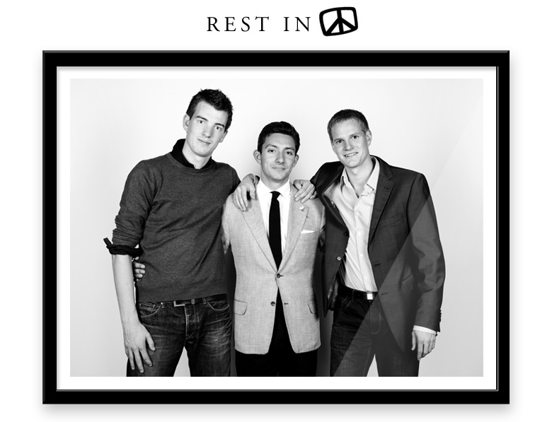

Graphic Violence 
================

###### 2000 – 2011

Don’t worry, we're still alive and kicking. But Graphic Violence is six feet under. What started off as a money-machine by 14-year old kids, grew into a serious web design business with many cool results: We’ve done some legendary stuff for a bunch of wonderful clients (and got ripped off by a few assholes along the way). We’ve parted as friends, simply because we all outgrew the business. It’s ok, please stop crying. We look back at 11 epic years of running, falling, getting up again and becoming more than we could ever have envisioned back in the old days.

Thanks to all who helped us along the way.
Here’s to the past. To now. And to the future.

**Roel van Duijnhoven, Tim Rutten & Marin Licina**